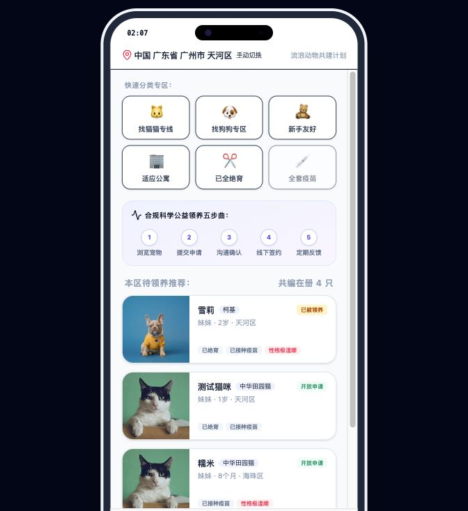
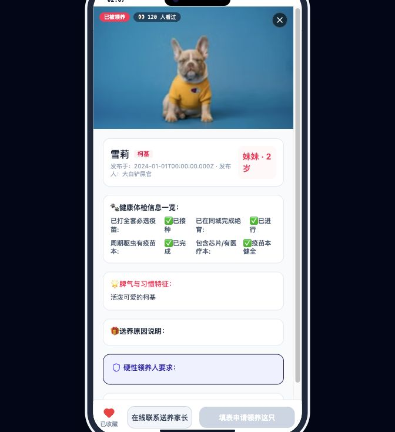
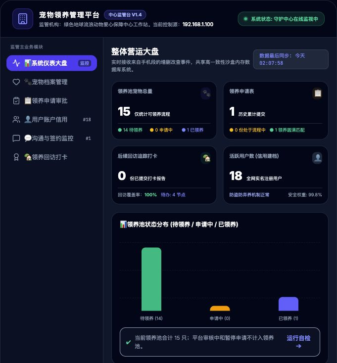
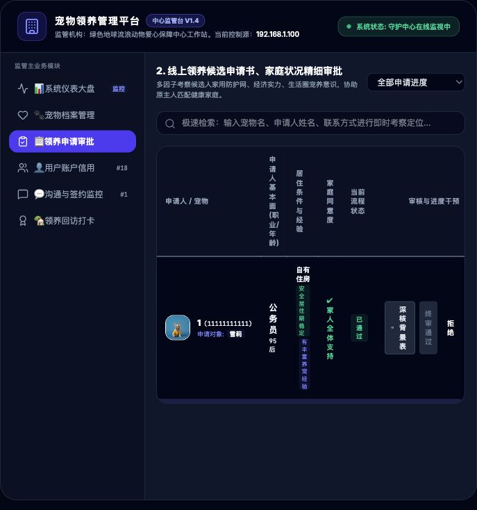
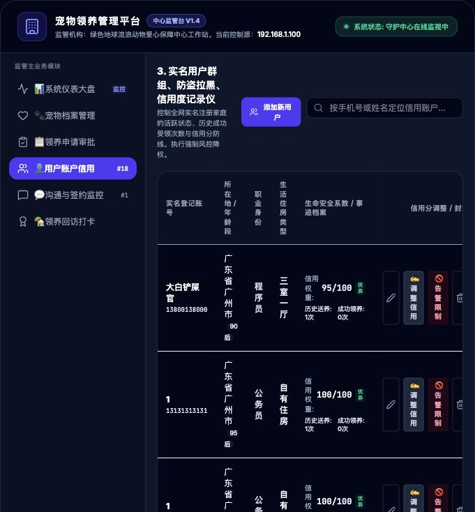
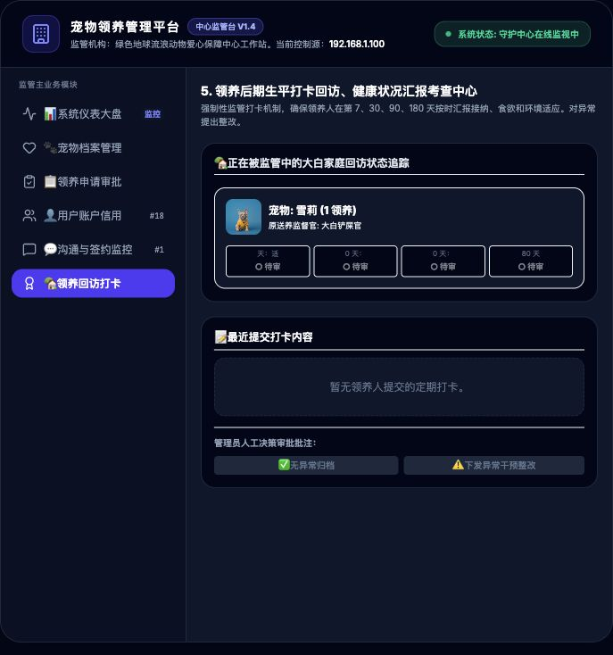

# 宠物领养全周期治理系统

面向流浪动物公益领养场景的 full-stack 项目，包含用户端移动应用、Express 后端 API 和后台管理系统。项目围绕“发布送养、提交领养申请、送养人初筛、后台终审、领养后定期回访”构建完整业务闭环，适合作为全栈开发课程项目、作品集项目或业务原型展示。

## 项目简介

本项目模拟一个公益宠物领养平台。普通用户可以注册登录、浏览同城待领养宠物、发布送养信息、提交领养申请、与送养人沟通，并在领养成功后完成定期回访打卡。

后台管理系统用于平台监管，包括宠物发布审核、领养申请终审、用户信用管理、回访打卡查看、运营数据统计和操作审计。前端与后台均通过同一个后端 API 读写数据，从而保证用户端和管理端状态同步。

## 项目截图

### 用户端首页



### 宠物详情页



### 后台管理仪表盘



### 领养申请审批



### 用户信用管理



### 领养回访打卡



## 功能特性

### 用户端 App

- 用户注册、登录、退出登录和资料维护
- 同城宠物浏览、筛选和详情查看
- 发布送养信息，并等待后台审核上架
- 对开放申请的宠物提交领养申请
- 送养人查看申请人信息并进行初筛
- 申请人与送养人聊天沟通、预约见面
- 领养成功后进行定期回访打卡
- 系统催打提醒和消息通知中心

### 后端 API 服务

- 用户、宠物、领养申请、聊天、预约、通知、回访计划等 RESTful API
- MySQL 数据持久化
- 首次启动时可从 `backend/db.json` 导入演示种子数据
- 管理端鉴权中间件和开发环境 mock token
- 领养流程状态控制：
  - `开放申请`：可提交领养申请
  - `申请处理中` / `已预约见面`：申请流程中
  - `已被领养`：终审通过，进入回访阶段
- 领养成功后自动生成回访计划

### 后台管理系统

- 系统仪表盘与领养池状态统计
- 宠物档案审核、上架、下架和编辑
- 领养申请查看、驳回和终审通过
- 用户账户管理、资料编辑、信用分调整和风控标记
- 聊天与签约流程监控
- 领养后回访打卡查看与批注
- 操作审计日志
- 流浪动物救助、医疗和生命善后记录展示

## 技术栈

### 用户端前端

- React 19
- TypeScript
- Vite
- Tailwind CSS
- Axios
- lucide-react
- motion

### 后台管理端

- React 19
- TypeScript
- Vite
- Tailwind CSS
- Axios
- lucide-react

### 后端

- Node.js
- Express
- TypeScript
- MySQL
- mysql2
- JSON Web Token
- dotenv
- helmet / cors / morgan

## 系统架构

系统由三部分组成：

1. **用户端 App**
   提供移动端风格的领养使用体验，包括宠物浏览、送养发布、领养申请、沟通和回访打卡。

2. **后端 API 服务**
   负责统一处理数据读写、状态流转、回访计划生成、通知、聊天和管理端操作。

3. **后台管理系统**
   面向平台管理员，用于监管宠物发布、领养申请、用户信用和领养后的回访履约情况。

```txt
用户端 App  ──┐
              ├── RESTful API ── MySQL
后台管理端 ──┘
```

用户在手机端提交申请后，后端会将宠物状态从 `开放申请` 更新为 `申请处理中`。送养人初筛通过后进入 `已预约见面`，后台终审通过后宠物进入 `已被领养`，系统随后生成定期回访计划。

## 项目结构

```txt
cat/
├── src/                    # 用户端 React 应用
│   ├── components/          # 用户端组件
│   ├── App.tsx              # 用户端主流程
│   └── types.ts             # 前端类型定义
├── admin-backend/           # 后台管理端 React 应用
│   ├── src/components/      # 管理端组件
│   ├── src/App.tsx          # 管理端入口逻辑
│   └── package.json
├── backend/                 # Express 后端服务
│   ├── src/controllers/     # 业务控制器
│   ├── src/routes/          # API 路由
│   ├── src/db.ts            # MySQL 数据访问层
│   ├── db.json              # 演示种子数据
│   └── package.json
├── docs/images/             # README 项目截图
├── package.json             # 用户端依赖与脚本
├── .env.example             # 用户端环境变量示例
└── README.md
```

## 本地运行

### 1. 克隆项目

```bash
git clone https://github.com/elinafff/yao-feng.git
cd yao-feng
```

### 2. 配置后端环境变量

```bash
cd backend
cp .env.example .env
```

根据本地 MySQL 修改 `backend/.env`：

```env
PORT=5005
JWT_SECRET=your_jwt_secret_key_here
NODE_ENV=development
MYSQL_HOST=127.0.0.1
MYSQL_PORT=3306
MYSQL_USER=root
MYSQL_PASSWORD=
MYSQL_DATABASE=pet_adoption
```

### 3. 启动后端 API

```bash
cd backend
npm install
npm run build
npm start
```

后端默认运行在：

```txt
http://127.0.0.1:5005
```

首次启动时，后端会自动创建数据库和数据表。如果表为空，会将 `backend/db.json` 中的演示数据导入 MySQL。

### 4. 启动用户端 App

在项目根目录运行：

```bash
npm install
npm run dev
```

用户端默认运行在：

```txt
http://127.0.0.1:3000
```

如果需要在手机上访问，请确保手机和电脑连接同一局域网，然后使用电脑的局域网 IP 访问，例如：

```txt
http://192.168.x.x:3000
```

### 5. 启动后台管理系统

```bash
cd admin-backend
npm install
npm run dev -- --port 5173 --host 127.0.0.1
```

后台管理端运行在：

```txt
http://127.0.0.1:5173
```

## 上传内容与安全说明

本仓库保留项目运行所需的源码、依赖清单、环境变量示例和演示数据。

建议上传：

- `src/`
- `admin-backend/src/`
- `backend/src/`
- `package.json` 和 `package-lock.json`
- `admin-backend/package.json` 和 `admin-backend/package-lock.json`
- `backend/package.json` 和 `backend/package-lock.json`
- `README.md`
- `.gitignore`
- `.env.example`
- `backend/.env.example`
- `admin-backend/.env.example`
- `backend/db.json`，仅作为演示种子数据
- `docs/images/`

不要上传：

- `node_modules/`
- `dist/`
- `build/`
- `.env`
- `.env.local`
- `backend/.env`
- 数据库真实密码、API Key、JWT Secret
- 真实用户手机号、地址、聊天记录或任何隐私数据
- `.DS_Store`
- `.codex/`
- `project.private.config.json`

## 项目亮点

- 完整的用户端、后端、管理端三端联动
- 真实数据库持久化，而不是纯前端静态页面
- 覆盖从发布送养到领养后回访的完整业务流程
- 后台包含审核、信用、风控、审计和统计模块
- 适合作为 React + Express + MySQL 的全栈实践项目

## 开发说明

当前项目更偏向功能原型和课程/作品集展示。生产环境使用前仍需要补充：

- 更严格的登录鉴权与权限控制
- 更完整的表结构设计和数据库迁移
- 表单校验和异常处理
- 单元测试和端到端测试
- 文件上传服务
- 真实短信/消息通知服务
- 隐私合规与数据脱敏

## 免责声明

本项目仅用于学习、研究和演示目的。项目中的用户、宠物、申请、聊天和回访数据应使用模拟数据，不应包含真实个人隐私。若用于真实领养业务，需要补充身份认证、隐私保护、线下核验、动物健康证明和法律合规流程。

## Author

Developed as a full-stack pet adoption lifecycle management project.
